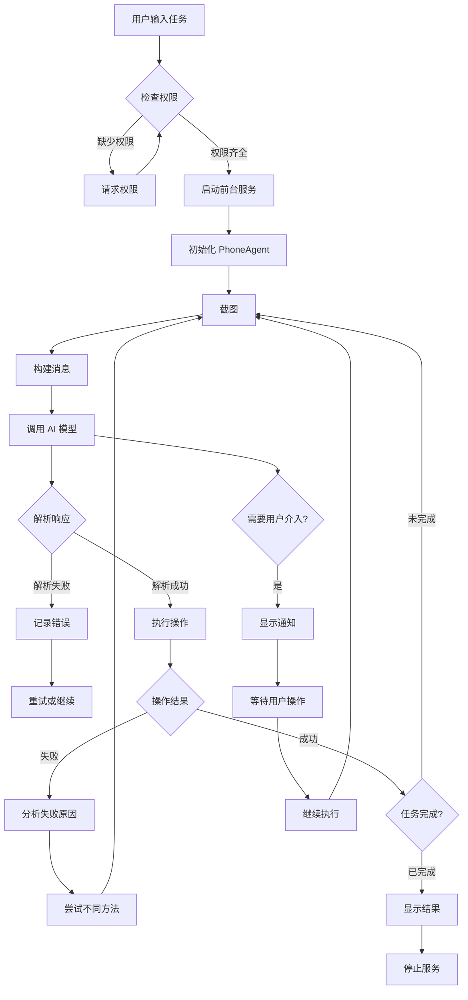

# Phone Agent Android APP

An Android app that simulates user operations via AccessibilityService. It integrates multiple AI service providers to intelligently understand screen content and automatically execute tasks.

## 📱 功能特性

- ✅ **多服务商支持**：支持 Ollama、OpenAI、Anthropic (Claude)、Google (Gemini)、Qwen (通义千问) 等
- ✅ **三种运行模式**：
  - **视觉模式**：通过截图上传图片给AI分析（需要屏幕录制权限）
  - **无障碍模式**：通过无障碍服务获取屏幕结构化内容（文本、控件信息、坐标等），无需截图
  - **混合模式**：结合视觉模式和无障碍模式，同时提供截图和结构化内容
- ✅ **无障碍服务操作**：通过无障碍服务模拟用户操作（点击、输入、滑动等）
- ✅ **智能屏幕分析**：自动截图或获取屏幕内容，通过 AI 模型分析并执行任务
- ✅ **任务自动执行**：根据 AI 分析结果自动执行操作，完成任务
- ✅ **完整操作支持**：支持 Launch、Tap、Type、Swipe、Long Press、Double Tap、Back、Home 等
- ✅ **用户介入机制**：遇到验证码、密码等需要用户操作时自动暂停等待
- ✅ **语音输入支持**：支持语音输入任务描述（需要设备支持语音识别）
- ✅ **后台执行**：支持前台服务，任务可在后台持续运行
- ✅ **详细日志**：显示 AI 思考过程、操作指令和执行结果
- ✅ **上下文管理**：智能压缩历史消息，避免上下文溢出

## 🏗️ 系统架构

### 核心组件

```
┌─────────────────────────────────────────────────────────────┐
│                      MainActivity                            │
│  - UI 界面管理                                               │
│  - 权限请求（无障碍、屏幕录制、通知、录音）                    │
│  - 任务输入和状态显示                                         │
│  - 语音输入支持                                              │
└──────────────────┬──────────────────────────────────────────┘
                    │
                    ├──────────────────────────────────────┐
                    │                                      │
        ┌───────────▼──────────┐              ┌───────────▼──────────┐
        │    PhoneAgent        │              │  SettingsActivity    │
        │  - 任务执行协调       │              │  - AI服务商配置       │
        │  - 截图管理          │              │  - API Key管理        │
        │  - 上下文管理        │              │  - 参数设置           │
        │  - 重试机制          │              └───────────────────────┘
        └───────────┬──────────┘
                    │
        ┌───────────┼──────────┐
        │           │           │
┌───────▼──────┐ ┌─▼────────┐ ┌▼──────────────┐
│ ModelClient  │ │ActionHandler│ │ScreenshotManager│
│ - 多服务商   │ │ - 操作解析  │ │ - 屏幕截图      │
│ - 格式转换   │ │ - 操作执行  │ │ - 图片编码      │
│ - API调用    │ └───────────┘ └─────────────────┘
└───────┬──────┘
        │
┌───────▼──────────────────────────────────────┐
│         PhoneAgentAccessibilityService        │
│  - 点击、输入、滑动等操作                      │
│  - 应用启动                                   │
│  - 当前应用信息获取                           │
└──────────────────────────────────────────────┘
```

## 🔄 执行流程图



## 📋 详细工作流程

### 1. 任务启动流程

```
用户输入任务
    ↓
检查权限（无障碍、屏幕录制、通知）
    ↓
启动前台服务（AgentForegroundService）
    ↓
初始化 PhoneAgent
    ↓
添加系统提示词到上下文
    ↓
开始执行循环
```

### 2. 单步执行流程

**视觉模式：**
```
截图（ScreenshotManager）
    ↓
将图片编码为 Base64
    ↓
构建消息（包含图片和任务描述）
    ↓
智能压缩上下文（如果超过阈值）
    ↓
调用 AI 模型（ModelClient）
    ↓
解析响应（提取 thinking 和 action）
    ↓
执行操作（ActionHandler）
    ↓
验证操作结果
    ↓
更新上下文（移除图片，添加结果）
    ↓
继续下一步或完成任务
```

**无障碍模式：**
```
获取屏幕内容（PhoneAgentAccessibilityService）
    ↓
提取文本、控件信息、坐标等结构化数据
    ↓
构建消息（包含结构化文本内容）
    ↓
智能压缩上下文（如果超过阈值）
    ↓
调用 AI 模型（ModelClient）
    ↓
解析响应（提取 thinking 和 action）
    ↓
执行操作（ActionHandler）
    ↓
验证操作结果
    ↓
更新上下文（添加结果）
    ↓
继续下一步或完成任务
```

**混合模式：**
```
同时获取截图和屏幕内容
    ↓
构建消息（包含图片和结构化文本）
    ↓
智能压缩上下文（如果超过阈值）
    ↓
调用 AI 模型（ModelClient）
    ↓
解析响应（提取 thinking 和 action）
    ↓
执行操作（ActionHandler）
    ↓
验证操作结果
    ↓
更新上下文（移除图片，保留文本，添加结果）
    ↓
继续下一步或完成任务
```

### 3. 操作执行流程

```
解析操作 JSON
    ↓
转换坐标（相对坐标 0-1000 → 绝对像素）
    ↓
调用无障碍服务执行操作
    ↓
等待操作完成
    ↓
返回执行结果
```

## 🎯 支持的操作类型

| 操作 | 格式 | 说明 |
|------|------|------|
| **Launch** | `{"_metadata":"do","action":"Launch","app":"应用名"}` | 启动应用 |
| **Tap** | `{"_metadata":"do","action":"Tap","element":[x,y]}` | 点击坐标（0-1000） |
| **Type** | `{"_metadata":"do","action":"Type","text":"文本"}` | 输入文本 |
| **Swipe** | `{"_metadata":"do","action":"Swipe","start":[x1,y1],"end":[x2,y2]}` | 滑动 |
| **Long Press** | `{"_metadata":"do","action":"Long Press","element":[x,y]}` | 长按 |
| **Double Tap** | `{"_metadata":"do","action":"Double Tap","element":[x,y]}` | 双击 |
| **Back** | `{"_metadata":"do","action":"Back"}` | 返回 |
| **Home** | `{"_metadata":"do","action":"Home"}` | 主页 |
| **Wait** | `{"_metadata":"do","action":"Wait","duration":"x seconds"}` | 等待 |
| **Take_over** | `{"_metadata":"do","action":"Take_over","message":"原因"}` | 用户接管 |
| **Interact** | `{"_metadata":"do","action":"Interact"}` | 用户交互选择 |
| **Note** | `{"_metadata":"do","action":"Note","message":"True"}` | 记录页面 |
| **Call_API** | `{"_metadata":"do","action":"Call_API","instruction":"内容"}` | API调用 |
| **finish** | `{"_metadata":"finish","message":"完成说明"}` | 完成任务 |

## 🤖 支持的 AI 服务商

### 1. Ollama（默认）
- **无需 API Key**
- **默认地址**: `http://127.0.0.1:11434/v1`
- **默认模型**: `qwen3-vl:32b`
- **图片格式**: Data URL
- **响应格式**: OpenAI 兼容

### 2. OpenAI
- **需要 API Key**
- **默认地址**: `https://api.openai.com/v1`
- **默认模型**: `gpt-4o`
- **图片格式**: Data URL
- **响应格式**: OpenAI 兼容

### 3. Anthropic (Claude)
- **需要 API Key**
- **默认地址**: `https://api.anthropic.com/v1`
- **默认模型**: `claude-3-5-sonnet-20241022`
- **图片格式**: Base64
- **响应格式**: Anthropic 格式

### 4. Google (Gemini)
- **需要 API Key**
- **默认地址**: `https://generativelanguage.googleapis.com/v1beta`
- **默认模型**: `gemini-pro-vision`
- **图片格式**: Base64
- **响应格式**: Google 格式

### 5. Qwen (通义千问)
- **需要 API Key**
- **默认地址**: `https://dashscope.aliyuncs.com/compatible-mode/v1`
- **默认模型**: `qwen-vl-max`
- **图片格式**: Data URL
- **响应格式**: OpenAI 兼容

### 6. GLM (智谱AI)
- **需要 API Key**
- **默认地址**: `https://open.bigmodel.cn/api/paas/v4`
- **默认模型**: `glm-4.5v`
- **图片格式**: Data URL
- **响应格式**: GLM 格式（支持 thinking 字段）
- **特色功能**: 支持思考模式，可获取详细的推理过程

### 7. 自定义
- 支持自定义 API 地址和模型
- 默认使用 OpenAI 兼容格式

## ⚙️ 配置说明

### 模型参数

- **Temperature**: 控制输出的随机性（0-2，默认 0.1）
  - 较低值：更确定、一致
  - 较高值：更随机、创造性
- **Top P**: 核采样参数（0-1，默认 0.85）
  - 控制模型考虑的概率质量

### 坐标系统

- **相对坐标**: 0-1000（AI 使用）
- **绝对坐标**: 实际屏幕像素（系统自动转换）
- **转换规则**: `绝对坐标 = (相对坐标 / 1000) * 屏幕尺寸`

## 📦 安装要求

- **Android 版本**: Android 7.0 (API 24) 及以上
- **必需权限**:
  - 无障碍服务权限（所有模式都需要，用于模拟操作和获取屏幕内容）
  - 屏幕录制权限（仅视觉模式和混合模式需要，用于截图）
  - 通知权限（用于显示任务状态）
  - 录音权限（可选，用于语音输入）

### 不同模式的权限要求

| 模式 | 无障碍服务 | 屏幕录制 | 说明 |
|------|-----------|---------|------|
| 视觉模式 | ✅ 必需 | ✅ 必需 | 需要截图功能 |
| 无障碍模式 | ✅ 必需 | ❌ 不需要 | 仅使用无障碍服务获取屏幕内容 |
| 混合模式 | ✅ 必需 | ✅ 必需 | 同时需要截图和无障碍内容 |

## 🚀 编译和安装

### 使用 Android Studio

1. 打开 Android Studio
2. 选择 "Open an Existing Project"
3. 选择 `android_app` 目录
4. 等待 Gradle 同步完成
5. 连接 Android 设备或启动模拟器
6. 点击 "Run" 按钮

### 使用命令行

```bash
cd android_app
./gradlew assembleDebug
adb install app/build/outputs/apk/debug/app-debug.apk
```

## 📖 使用说明

### 1. 首次使用设置

#### 启用无障碍服务
1. 安装应用后，打开应用
2. 点击"打开无障碍设置"按钮
3. 在设置中找到 "Phone Agent"
4. 启用服务

#### 授予屏幕录制权限（仅视觉模式和混合模式）
- **视觉模式**和**混合模式**：应用会自动请求屏幕录制权限，用于截图功能
- **无障碍模式**：不需要屏幕录制权限，可以直接使用

#### 选择运行模式
1. 在主界面选择运行模式：
   - **视觉模式**：适合需要视觉识别的场景（图标、图片、复杂布局）
   - **无障碍模式**：适合文本操作、表单填写等场景，速度更快，资源占用更少
   - **混合模式**：结合两种模式的优势，适合复杂场景

#### 配置 AI 服务商
1. 点击"设置"按钮
2. 选择 AI 服务商
3. 填写 API 地址和模型名称
4. 如需 API Key，填写 API Key
5. 调整 Temperature 和 Top P 参数（可选）
6. 点击"保存设置"

### 2. 执行任务

1. **选择运行模式**（在主界面顶部）：
   - 视觉模式：需要屏幕录制权限，通过截图分析
   - 无障碍模式：无需屏幕录制权限，通过结构化内容分析
   - 混合模式：需要屏幕录制权限，同时使用截图和结构化内容
2. 在"任务描述"输入框中输入任务，例如：
   - "打开小红书搜索武汉旅游路线"
   - "打开微信查看消息"
   - "打开淘宝搜索手机并加入购物车"
3. 点击"开始任务"按钮
4. 查看执行日志了解任务进度
   - 思考过程：AI 的分析和计划
   - 操作指令：具体执行的操作
   - 执行结果：操作是否成功
5. 任务完成后会显示结果

### 模式选择建议

- **视觉模式**：适合需要识别图标、图片、复杂布局的场景
- **无障碍模式**：适合文本操作、表单填写、列表浏览等场景，速度更快，资源占用更少
- **混合模式**：适合复杂场景，提供最全面的信息，但资源占用最大

### 3. 语音输入（可选）

1. 点击右下角的语音输入按钮
2. 说出任务描述
3. 系统会自动识别并填入任务输入框

## 📁 项目结构

```
android_app/
├── app/
│   └── src/main/
│       ├── java/com/mobileagent/phoneagent/
│       │   ├── MainActivity.kt              # 主界面
│       │   ├── SettingsActivity.kt          # 设置界面
│       │   ├── agent/
│       │   │   └── PhoneAgent.kt            # 核心智能体
│       │   ├── action/
│       │   │   └── ActionHandler.kt         # 操作执行器
│       │   ├── model/
│       │   │   ├── ModelClient.kt           # AI 模型客户端
│       │   │   └── ModelProvider.kt         # 服务商配置
│       │   ├── service/
│       │   │   ├── PhoneAgentAccessibilityService.kt  # 无障碍服务
│       │   │   └── AgentForegroundService.kt          # 前台服务
│       │   └── utils/
│       │       ├── ScreenshotUtils.kt       # 截图工具
│       │       ├── AppLauncher.kt           # 应用启动器
│       │       └── VoiceActivityDetector.kt # 语音活动检测
│       ├── res/                             # 资源文件
│       └── AndroidManifest.xml              # 应用配置
└── build.gradle                             # 构建配置
```

## 🔧 核心组件说明

### PhoneAgentAccessibilityService
无障碍服务，负责：
- 模拟用户操作（点击、输入、滑动等）
- 获取当前应用信息
- 启动应用
- 文本输入（支持多种输入方式）
- 获取屏幕结构化内容（无障碍模式）：提取文本、控件信息、坐标等

### PhoneAgent
核心智能体，负责：
- 协调 AI 模型调用
- 管理任务执行流程
- 根据模式选择数据获取方式（截图/无障碍内容/混合）
- 截图和屏幕分析（视觉模式和混合模式）
- 获取屏幕结构化内容（无障碍模式和混合模式）
- 上下文管理（智能压缩）
- 操作执行和重试机制

### ModelClient
AI 模型客户端，负责：
- 支持多个 AI 服务商
- 处理不同服务商的格式差异
- 图片格式转换（Data URL / Base64）
- 响应格式解析（OpenAI / Anthropic / Google）

### ActionHandler
操作执行器，负责：
- 解析 AI 返回的操作指令
- 坐标转换（相对 → 绝对）
- 执行具体操作（点击、输入等）
- 返回执行结果

### SettingsActivity
设置界面，负责：
- AI 服务商选择
- API 配置（地址、模型、Key）
- 参数调整（Temperature、Top P）

## ⚠️ 注意事项

1. **无障碍服务**: 所有模式都必须启用才能正常工作
2. **屏幕录制权限**: 
   - 视觉模式和混合模式需要屏幕录制权限
   - 无障碍模式不需要屏幕录制权限
3. **模式选择**: 
   - 无障碍模式速度更快，资源占用更少，适合文本操作场景
   - 视觉模式适合需要识别图标、图片的场景
   - 混合模式提供最全面的信息，但资源占用最大
4. **网络权限**: 需要网络连接调用 AI 模型 API
5. **电池优化**: 建议将应用加入电池优化白名单，避免被系统杀死
6. **应用映射**: 应用名称到包名的映射在 `AppLauncher.kt` 中，系统会自动查找
7. **坐标系统**: AI 使用相对坐标（0-1000），系统自动转换为绝对像素
8. **上下文管理**: 系统会自动压缩历史消息，避免上下文溢出
9. **重试机制**: 操作失败后会自动重试，尝试不同方法

## 🐛 常见问题

### 1. 点击坐标不准确
- 确保坐标系统使用相对坐标（0-1000）
- 系统会自动转换为屏幕实际像素位置
- 如果仍有问题，检查屏幕尺寸是否正确获取

### 2. 文本输入失败
- 确保输入框已聚焦（先点击输入框）
- 系统会自动清除现有文本
- 如果失败，系统会尝试使用剪贴板方式

### 3. 应用启动失败
- 检查应用名称是否正确
- 系统会自动查找相似应用
- 可以尝试使用应用的确切显示名称

### 4. AI 模型调用失败
- 检查网络连接
- 验证 API 地址和 Key 是否正确
- 查看日志了解详细错误信息

## 📝 更新日志

### v1.1.0
- ✅ 新增三种运行模式：视觉模式、无障碍模式、混合模式
- ✅ 无障碍模式无需屏幕录制权限，通过无障碍服务获取屏幕结构化内容
- ✅ 优化权限检查逻辑，根据模式动态请求所需权限
- ✅ 改进语音识别检查机制，提供更友好的错误提示

### v1.0.0
- ✅ 基础功能实现
- ✅ 多服务商支持
- ✅ 语音输入支持
- ✅ 上下文智能压缩
- ✅ 详细日志显示
- ✅ 用户介入机制

## 📄 许可证

本项目采用 [MIT License](LICENSE) 开源协议。

**重要提示**: 本项目仅供研究和学习使用。严禁用于非法获取信息、干扰系统或任何违法活动。

## 🤝 贡献

欢迎提交 Issue 和 Pull Request！

### 贡献指南

1. Fork 本仓库
2. 创建特性分支 (`git checkout -b feature/AmazingFeature`)
3. 提交更改 (`git commit -m 'Add some AmazingFeature'`)
4. 推送到分支 (`git push origin feature/AmazingFeature`)
5. 开启 Pull Request

⭐ 如果这个项目对您有帮助，请给个 Star 支持一下！
