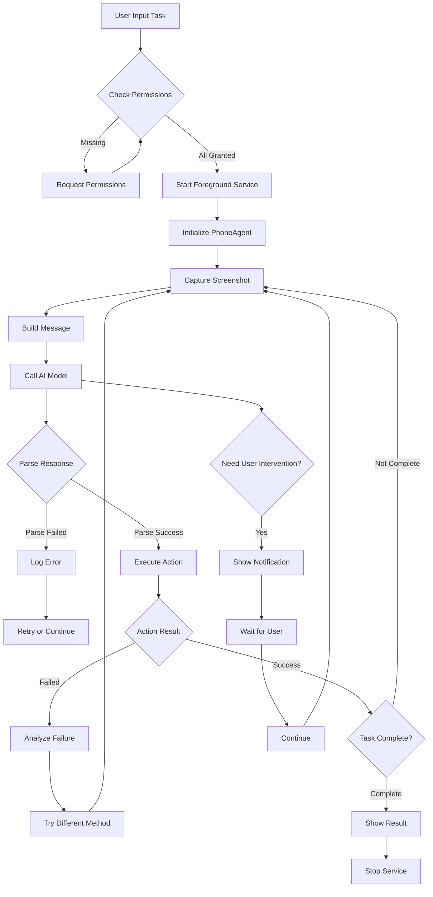

# Phone Agent Android APP

An Android application that simulates user operations through AccessibilityService without requiring ADB connection. The app integrates support for multiple AI service providers and can intelligently understand screen content and automatically execute tasks.


## 📱 Features

- ✅ **Multi-Provider Support**: Supports Ollama, OpenAI, Anthropic (Claude), Google (Gemini), Qwen (通义千问), etc.
- ✅ **Three Operation Modes**:
  - **Vision Mode**: Analyzes screenshots uploaded to AI (requires screen recording permission)
  - **Accessibility Mode**: Gets structured screen content (text, control info, coordinates, etc.) through accessibility service without screenshots
  - **Hybrid Mode**: Combines vision mode and accessibility mode, providing both screenshots and structured content
- ✅ **Accessibility Service Operations**: Simulates user operations (tap, input, swipe, etc.) through accessibility service
- ✅ **Intelligent Screen Analysis**: Automatically captures screenshots or gets screen content, analyzes through AI models and executes tasks
- ✅ **Automatic Task Execution**: Executes operations based on AI analysis results to complete tasks
- ✅ **Complete Operation Support**: Supports Launch, Tap, Type, Swipe, Long Press, Double Tap, Back, Home, etc.
- ✅ **User Intervention Mechanism**: Automatically pauses and waits when encountering verification codes, passwords, etc. that require user operations
- ✅ **Voice Input Support**: Supports voice input for task descriptions (requires device voice recognition support)
- ✅ **Background Execution**: Supports foreground service, tasks can run continuously in the background
- ✅ **Detailed Logs**: Displays AI thinking process, operation instructions and execution results
- ✅ **Context Management**: Intelligently compresses historical messages to avoid context overflow

## 🏗️ System Architecture

### Core Components

```
┌─────────────────────────────────────────────────────────────┐
│                      MainActivity                            │
│  - UI Management                                            │
│  - Permission Requests (Accessibility, Screen Recording,   │
│    Notification, Audio)                                     │
│  - Task Input and Status Display                            │
│  - Voice Input Support                                      │
└──────────────────┬──────────────────────────────────────────┘
                    │
                    ├──────────────────────────────────────┐
                    │                                      │
        ┌───────────▼──────────┐              ┌───────────▼──────────┐
        │    PhoneAgent        │              │  SettingsActivity    │
        │  - Task Execution    │              │  - AI Provider Config │
        │    Coordination      │              │  - API Key Management │
        │  - Screenshot Mgmt   │              │  - Parameter Settings │
        │  - Context Mgmt      │              └───────────────────────┘
        │  - Retry Mechanism   │
        └───────────┬──────────┘
                    │
        ┌───────────┼──────────┐
        │           │           │
┌───────▼──────┐ ┌─▼────────┐ ┌▼──────────────┐
│ ModelClient  │ │ActionHandler│ │ScreenshotManager│
│ - Multi-     │ │ - Action    │ │ - Screen Capture │
│   Provider   │ │   Parsing   │ │ - Image Encoding │
│ - Format     │ │ - Action    │ └─────────────────┘
│   Conversion │ │   Execution │
│ - API Calls  │ └───────────┘
└───────┬──────┘
        │
┌───────▼──────────────────────────────────────┐
│         PhoneAgentAccessibilityService        │
│  - Tap, Input, Swipe Operations              │
│  - App Launch                                 │
│  - Current App Info Retrieval                │
└──────────────────────────────────────────────┘
```

## 🔄 Execution Flow



## 📋 Detailed Workflow

### 1. Task Startup Flow

```
User Input Task
    ↓
Check Permissions (Accessibility, Screen Recording, Notification)
    ↓
Start Foreground Service (AgentForegroundService)
    ↓
Initialize PhoneAgent
    ↓
Add System Prompt to Context
    ↓
Start Execution Loop
```

### 2. Single Step Execution Flow

**Vision Mode:**
```
Capture Screenshot (ScreenshotManager)
    ↓
Encode Image to Base64
    ↓
Build Message (Include Image and Task Description)
    ↓
Intelligent Context Compression (if exceeds threshold)
    ↓
Call AI Model (ModelClient)
    ↓
Parse Response (Extract thinking and action)
    ↓
Execute Action (ActionHandler)
    ↓
Verify Action Result
    ↓
Update Context (Remove Image, Add Result)
    ↓
Continue Next Step or Complete Task
```

**Accessibility Mode:**
```
Get Screen Content (PhoneAgentAccessibilityService)
    ↓
Extract Text, Control Info, Coordinates, etc. (Structured Data)
    ↓
Build Message (Include Structured Text Content)
    ↓
Intelligent Context Compression (if exceeds threshold)
    ↓
Call AI Model (ModelClient)
    ↓
Parse Response (Extract thinking and action)
    ↓
Execute Action (ActionHandler)
    ↓
Verify Action Result
    ↓
Update Context (Add Result)
    ↓
Continue Next Step or Complete Task
```

**Hybrid Mode:**
```
Get Screenshot and Screen Content Simultaneously
    ↓
Build Message (Include Image and Structured Text)
    ↓
Intelligent Context Compression (if exceeds threshold)
    ↓
Call AI Model (ModelClient)
    ↓
Parse Response (Extract thinking and action)
    ↓
Execute Action (ActionHandler)
    ↓
Verify Action Result
    ↓
Update Context (Remove Image, Keep Text, Add Result)
    ↓
Continue Next Step or Complete Task
```

### 3. Action Execution Flow

```
Parse Action JSON
    ↓
Convert Coordinates (Relative 0-1000 → Absolute Pixels)
    ↓
Call Accessibility Service to Execute Action
    ↓
Wait for Action Completion
    ↓
Return Execution Result
```

## 🎯 Supported Action Types

| Action | Format | Description |
|--------|--------|-------------|
| **Launch** | `{"_metadata":"do","action":"Launch","app":"AppName"}` | Launch app |
| **Tap** | `{"_metadata":"do","action":"Tap","element":[x,y]}` | Tap coordinates (0-1000) |
| **Type** | `{"_metadata":"do","action":"Type","text":"Text"}` | Input text |
| **Swipe** | `{"_metadata":"do","action":"Swipe","start":[x1,y1],"end":[x2,y2]}` | Swipe |
| **Long Press** | `{"_metadata":"do","action":"Long Press","element":[x,y]}` | Long press |
| **Double Tap** | `{"_metadata":"do","action":"Double Tap","element":[x,y]}` | Double tap |
| **Back** | `{"_metadata":"do","action":"Back"}` | Back |
| **Home** | `{"_metadata":"do","action":"Home"}` | Home |
| **Wait** | `{"_metadata":"do","action":"Wait","duration":"x seconds"}` | Wait |
| **Take_over** | `{"_metadata":"do","action":"Take_over","message":"Reason"}` | User takeover |
| **Interact** | `{"_metadata":"do","action":"Interact"}` | User interaction selection |
| **Note** | `{"_metadata":"do","action":"Note","message":"True"}` | Record page |
| **Call_API** | `{"_metadata":"do","action":"Call_API","instruction":"Content"}` | API call |
| **finish** | `{"_metadata":"finish","message":"Completion Description"}` | Complete task |

## 🤖 Supported AI Providers

### 1. Ollama (Default)
- **No API Key Required**
- **Default URL**: `http://127.0.0.1:11434/v1`
- **Default Model**: `qwen3-vl:32b`
- **Image Format**: Data URL
- **Response Format**: OpenAI Compatible

### 2. OpenAI
- **API Key Required**
- **Default URL**: `https://api.openai.com/v1`
- **Default Model**: `gpt-4o`
- **Image Format**: Data URL
- **Response Format**: OpenAI Compatible

### 3. Anthropic (Claude)
- **API Key Required**
- **Default URL**: `https://api.anthropic.com/v1`
- **Default Model**: `claude-3-5-sonnet-20241022`
- **Image Format**: Base64
- **Response Format**: Anthropic Format

### 4. Google (Gemini)
- **API Key Required**
- **Default URL**: `https://generativelanguage.googleapis.com/v1beta`
- **Default Model**: `gemini-pro-vision`
- **Image Format**: Base64
- **Response Format**: Google Format

### 5. Qwen (通义千问)
- **API Key Required**
- **Default URL**: `https://dashscope.aliyuncs.com/compatible-mode/v1`
- **Default Model**: `qwen-vl-max`
- **Image Format**: Data URL
- **Response Format**: OpenAI Compatible

### 6. GLM (智谱AI)
- **API Key Required**
- **Default URL**: `https://open.bigmodel.cn/api/paas/v4`
- **Default Model**: `glm-4.5v`
- **Image Format**: Data URL
- **Response Format**: GLM Format (supports thinking field)
- **Special Features**: Supports thinking mode, can get detailed reasoning process

### 7. Custom
- Supports custom API URL and model
- Default uses OpenAI compatible format

## ⚙️ Configuration

### Model Parameters

- **Temperature**: Controls output randomness (0-2, default 0.1)
  - Lower value: More deterministic and consistent
  - Higher value: More random and creative
- **Top P**: Nucleus sampling parameter (0-1, default 0.85)
  - Controls the probability mass considered by the model

### Coordinate System

- **Relative Coordinates**: 0-1000 (used by AI)
- **Absolute Coordinates**: Actual screen pixels (automatically converted by system)
- **Conversion Rule**: `Absolute Coordinate = (Relative Coordinate / 1000) * Screen Size`

## 📦 Installation Requirements

- **Android Version**: Android 7.0 (API 24) and above
- **Required Permissions**:
  - Accessibility Service Permission (required for all modes, for simulating operations and getting screen content)
  - Screen Recording Permission (only required for Vision Mode and Hybrid Mode, for screenshots)
  - Notification Permission (for displaying task status)
  - Audio Permission (optional, for voice input)

### Permission Requirements by Mode

| Mode | Accessibility Service | Screen Recording | Description |
|------|---------------------|------------------|-------------|
| Vision Mode | ✅ Required | ✅ Required | Needs screenshot functionality |
| Accessibility Mode | ✅ Required | ❌ Not Required | Only uses accessibility service to get screen content |
| Hybrid Mode | ✅ Required | ✅ Required | Needs both screenshot and accessibility content |

## 🚀 Build and Install

### Using Android Studio

1. Open Android Studio
2. Select "Open an Existing Project"
3. Select the project directory
4. Wait for Gradle sync to complete
5. Connect Android device or start emulator
6. Click "Run" button

### Using Command Line

```bash
./gradlew assembleDebug
adb install app/build/outputs/apk/debug/app-debug.apk
```

## 📖 Usage Instructions

### 1. First-Time Setup

#### Enable Accessibility Service
1. After installing the app, open it
2. Click "Open Accessibility Settings" button
3. Find "Phone Agent" in settings
4. Enable the service

#### Grant Screen Recording Permission (Vision Mode and Hybrid Mode Only)
- **Vision Mode** and **Hybrid Mode**: The app will automatically request screen recording permission for screenshot functionality
- **Accessibility Mode**: No screen recording permission needed, can be used directly

#### Select Operation Mode
1. Select operation mode on main interface:
   - **Vision Mode**: Suitable for scenarios requiring visual recognition (icons, images, complex layouts)
   - **Accessibility Mode**: Suitable for text operations, form filling, etc. Faster and uses fewer resources
   - **Hybrid Mode**: Combines advantages of both modes, suitable for complex scenarios

#### Configure AI Provider
1. Click "Settings" button
2. Select AI provider
3. Fill in API URL and model name
4. If API Key is required, fill in API Key
5. Adjust Temperature and Top P parameters (optional)
6. Click "Save Settings"

### 2. Execute Tasks

1. **Select Operation Mode** (at top of main interface):
   - Vision Mode: Requires screen recording permission, analyzes through screenshots
   - Accessibility Mode: No screen recording permission needed, analyzes through structured content
   - Hybrid Mode: Requires screen recording permission, uses both screenshots and structured content
2. Enter task in "Task Description" input box, for example:
   - "Open Xiaohongshu and search for Wuhan travel routes"
   - "Open WeChat and check messages"
   - "Open Taobao, search for phones and add to cart"
3. Click "Start Task" button
4. View execution logs to understand task progress
   - Thinking Process: AI's analysis and planning
   - Operation Instructions: Specific operations executed
   - Execution Results: Whether operations succeeded
5. Results will be displayed when task completes

### Mode Selection Recommendations

- **Vision Mode**: Suitable for scenarios requiring icon, image, and complex layout recognition
- **Accessibility Mode**: Suitable for text operations, form filling, list browsing, etc. Faster and uses fewer resources
- **Hybrid Mode**: Suitable for complex scenarios, provides most comprehensive information but uses most resources

### 3. Voice Input (Optional)

1. Click voice input button at bottom right
2. Speak task description
3. System will automatically recognize and fill task input box

## 📁 Project Structure

```
app/
└── src/main/
    ├── java/com/mobileagent/phoneagent/
    │   ├── MainActivity.kt              # Main Interface
    │   ├── SettingsActivity.kt          # Settings Interface
    │   ├── agent/
    │   │   └── PhoneAgent.kt            # Core Agent
    │   ├── action/
    │   │   └── ActionHandler.kt         # Action Executor
    │   ├── model/
    │   │   ├── ModelClient.kt           # AI Model Client
    │   │   └── ModelProvider.kt         # Provider Configuration
    │   ├── service/
    │   │   ├── PhoneAgentAccessibilityService.kt  # Accessibility Service
    │   │   └── AgentForegroundService.kt          # Foreground Service
    │   └── utils/
    │       ├── ScreenshotUtils.kt       # Screenshot Utilities
    │       ├── AppLauncher.kt           # App Launcher
    │       └── VoiceActivityDetector.kt # Voice Activity Detection
    ├── res/                             # Resource Files
    └── AndroidManifest.xml              # App Configuration
└── build.gradle                         # Build Configuration
```

## 🔧 Core Component Descriptions

### PhoneAgentAccessibilityService
Accessibility service, responsible for:
- Simulating user operations (tap, input, swipe, etc.)
- Getting current app information
- Launching apps
- Text input (supports multiple input methods)
- Getting screen structured content (Accessibility Mode): Extracts text, control info, coordinates, etc.

### PhoneAgent
Core agent, responsible for:
- Coordinating AI model calls
- Managing task execution flow
- Selecting data acquisition method based on mode (screenshot/accessibility content/hybrid)
- Screenshot and screen analysis (Vision Mode and Hybrid Mode)
- Getting screen structured content (Accessibility Mode and Hybrid Mode)
- Context management (intelligent compression)
- Action execution and retry mechanism

### ModelClient
AI model client, responsible for:
- Supporting multiple AI providers
- Handling format differences between providers
- Image format conversion (Data URL / Base64)
- Response format parsing (OpenAI / Anthropic / Google)

### ActionHandler
Action executor, responsible for:
- Parsing operation instructions returned by AI
- Coordinate conversion (relative → absolute)
- Executing specific operations (tap, input, etc.)
- Returning execution results

### SettingsActivity
Settings interface, responsible for:
- AI provider selection
- API configuration (URL, model, Key)
- Parameter adjustment (Temperature, Top P)

## ⚠️ Important Notes

1. **Accessibility Service**: Must be enabled for all modes to work properly
2. **Screen Recording Permission**: 
   - Vision Mode and Hybrid Mode require screen recording permission
   - Accessibility Mode does not require screen recording permission
3. **Mode Selection**: 
   - Accessibility Mode is faster, uses fewer resources, suitable for text operation scenarios
   - Vision Mode is suitable for scenarios requiring icon and image recognition
   - Hybrid Mode provides most comprehensive information but uses most resources
4. **Network Permission**: Requires network connection to call AI model API
5. **Battery Optimization**: Recommend adding app to battery optimization whitelist to avoid being killed by system
6. **App Mapping**: App name to package name mapping is in `AppLauncher.kt`, system will automatically search
7. **Coordinate System**: AI uses relative coordinates (0-1000), system automatically converts to absolute pixels
8. **Context Management**: System automatically compresses historical messages to avoid context overflow
9. **Retry Mechanism**: Automatically retries after operation failure, tries different methods

## 🐛 Common Issues

### 1. Tap Coordinates Inaccurate
- Ensure coordinate system uses relative coordinates (0-1000)
- System automatically converts to actual screen pixel positions
- If problem persists, check if screen size is correctly obtained

### 2. Text Input Failed
- Ensure input field is focused (tap input field first)
- System automatically clears existing text
- If fails, system will try using clipboard method

### 3. App Launch Failed
- Check if app name is correct
- System automatically searches for similar apps
- Can try using app's exact display name

### 4. AI Model Call Failed
- Check network connection
- Verify API URL and Key are correct
- View logs for detailed error information

## 📝 Changelog

### v1.1.0
- ✅ Added three operation modes: Vision Mode, Accessibility Mode, Hybrid Mode
- ✅ Accessibility Mode doesn't require screen recording permission, gets screen structured content through accessibility service
- ✅ Optimized permission check logic, dynamically requests required permissions based on mode
- ✅ Improved voice recognition check mechanism, provides more user-friendly error prompts

### v1.0.0
- ✅ Basic functionality implementation
- ✅ Multi-provider support
- ✅ Voice input support
- ✅ Intelligent context compression
- ✅ Detailed log display
- ✅ User intervention mechanism

## 📄 License

This project is licensed under the [MIT License](LICENSE).

**Important Notice**: This project is for research and learning purposes only. Strictly prohibited for illegal information acquisition, system interference, or any illegal activities.

## 🤝 Contributing

Welcome to submit Issues and Pull Requests!

### Contributing Guidelines

1. Fork this repository
2. Create feature branch (`git checkout -b feature/AmazingFeature`)
3. Commit changes (`git commit -m 'Add some AmazingFeature'`)
4. Push to branch (`git push origin feature/AmazingFeature`)
5. Open Pull Request

---

⭐ If this project helps you, please give it a Star!

